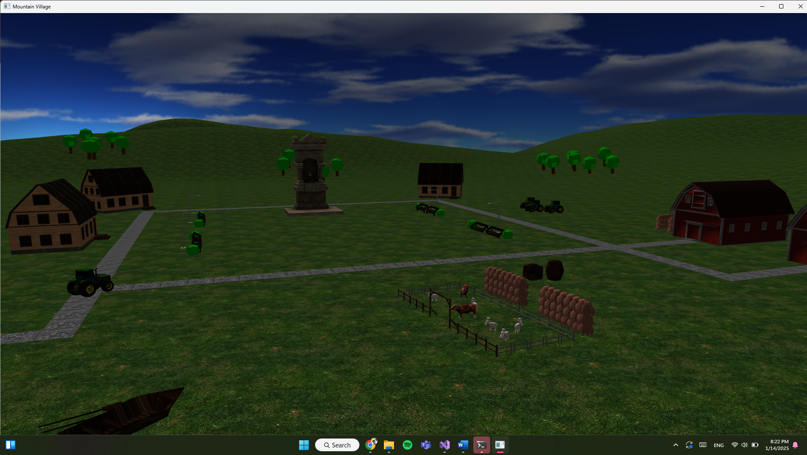

# Mountain Village 3D Scene 

## Description

The main goal of this project is to create a photorealistic presentation of 3D object scenes using **OpenGL**, **GLFW** and **GLM** libraries, along with the **Blender** 3D modeling environment. 

## Features
  - **Scene Navigation:** WASD for movement and the mouse for rotation and zoom
  - **Lighting Control:** toggle a directional light (simulating sunshine) and point lights (lanterns) on and off
  - **Weather Effects:** fog, rain and thunder effects (sound included)
  - **Automated Tour:** explore the scene automatically with background music
  - **Object Movement:** use arrow keys to move a boat across water 

## Technologies Used

  - **OpenGL**
  - **GLFW** and **GLM**
  - **Blender**
  - **C++**

